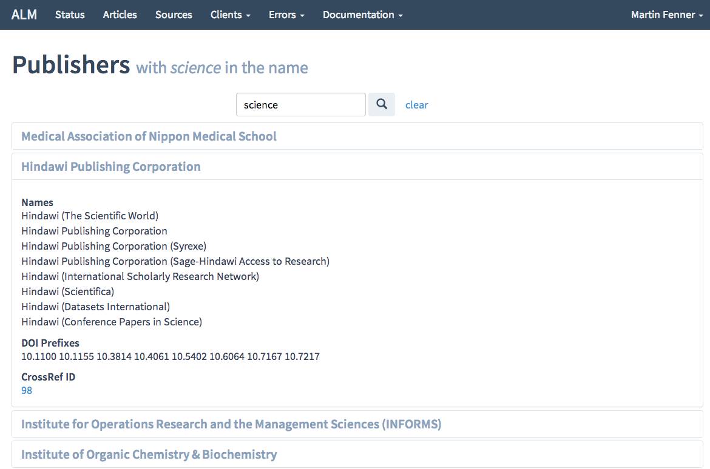

In a [post last week](/2014/07/18/roads-not-stagecoaches/) I talked about roads and stagecoaches, and how work on scholarly infrastructure can often be more important than building customer-facing apps. One important aspect of that infrastruture work is to not duplicate efforts.<!--more-->

](images/5673321593_e6a7faa36d_z.jpg)

A good example is information (or metadata) about scholarly publications. I am the technical lead for the open source [article-level metrics (ALM) software](http://articlemetrics.github.io/). This software can be used in different ways, but most people use it for tracking the metrics of scholarly articles, with articles that have DOIs issued by CrossRef. The ALM software needs three pieces of information for every article: **DOI**, **publication date**, and **title**. This information can be entered via a web interface, but that is of course not very practical for adding dozens or hundreds of articles at a time. The ALM software has therefore long supported the import of multiple articles via a text file and the command line.

This approach is working fine for the ALM software [running at PLOS since 2009](http://articlemetrics.github.io/plos/), but is for example a problem if the ALM software runs as a service for multiple publishers. A more flexible approach is to provide an API to upload articles, and I've [added an API](http://articlemetrics.github.io/docs/api/) for creating, updating and deleting articles in January 2014.

While the API is an improvement, it still requires the integration into a number of possibly very different publisher workflows, and you have to deal with setting up the permissions, e.g. so that publisher A can't delete an article from publisher B.

The next ALM release (3.3) will therefore add a third approach to importing articles: using the [CrossRef API](http://api.crossref.org) to look up article information. Article-level metrics is about tracking already published works, so we really only care about articles that have DOIs registered with CrossRef and are therefore published. ALM is now talking to a single API, and this makes it much easier to do this for a number of publishers without writing custom code. Since ALM is an open source application already used by several publishers that aspect is important. And because we are importing, we have don't have to worry about permissions. The only requirement is that CrossRef has the correct article information, and has this information as soon as possible after publication.

At this point I have a confession to make: I regularly use other CrossRef APIs, but wasn't aware of **api.crossref.org** until fairly recently. That is sort of understandable since the reference platform was deployed only September last year. The documentation to get you started is on [Github](https://github.com/CrossRef/rest-api-doc/blob/master/rest_api.md) and the version history shows frequent API updates (now at v22). The API will return all kinds of information, e.g.

* how many articles has publisher x published in 2012
* percentage of DOIs of publisher Y that include at least one ORCID identifier
* list all books with a Creative Commons CC-BY license that were published this year

Funder (via FundRef) information is also included, but is still incomplete. Another interesting result is the number of [component DOIs](http://blogs.plos.org/mfenner/2011/03/26/direct-links-to-figures-and-tables-using-component-dois/) (DOIs for figures, tables or other parts of a document) per year:

<iframe src="http://cf.datawrapper.de/Ze7et/1/" frameborder="0" allowtransparency="true" allowfullscreen="allowfullscreen" webkitallowfullscreen="webkitallowfullscreen" mozallowfullscreen="mozallowfullscreen" oallowfullscreen="oallowfullscreen" msallowfullscreen="msallowfullscreen" width="640" height="480"></iframe>

For my specific use case I wanted an API call that returns all articles published by PLOS (or any other publisher) in the last day which I can then run regularly. To get all DOIs from a specific publisher, use their CrossRef member ID - DOI prefixes don't work, as publishers can own more than one DOI prefix. To make this task a little easier I built a CrossRef member search interface into the ALM application:



We can filter API responses by publication date, but it is a better idea to use the update date, as it is possible that the metadata have changed, e.g. a correction of the title. We also want to increase the number of results per page (using the `rows` parameter). The final API call for all DOIs updated by PLOS since the beginning of the week would be

```
http://api.crossref.org/members/340/works?filter=from-update-date:2014-07-21,until-update-date:2014-07-24&rows=1000
```

The next step is of course to parse the JSON of the API response, and you will notice that CrossRef is using [Citeproc JSON](http://gsl-nagoya-u.net/http/pub/citeproc-doc.html). This is a standard JSON format for bibliographic information used internally by several reference managers for citation styles, but increasingly also by APIs and other places where you encounter bibliographic information.

Citeproc JSON is helpful for one particular problem with CrossRef metadata: the exact publication date for an article is not always known, and CrossRef (and similarly DataCite) only requires the publication year. Citeproc JSON can nicely handle partial dates, e.g. year-month:

```
issued: {
  date-parts: [
    [
      2014,
      7
    ]
  ]
},
```

I think that a similar approach will work for many other systems that require bibliographic information about scholarly content with CrossRef DOIs. If are not already using **api.crossref.org**, consider integrating with it, I find the API fast, well documented, easy to use - and CrossRef is very responsive to feedback. As you can always wish for more, I would like to see the following: fix the problem were some journal articles are missing the publication date (a required field, even if only the year), and consider adding the canonical URL to the article metadata (which ALM currently has to look up itself, and which is needed to track social media coverage of an article).

*Update July 24, 2014: added chart with number of component DOIs per year*
